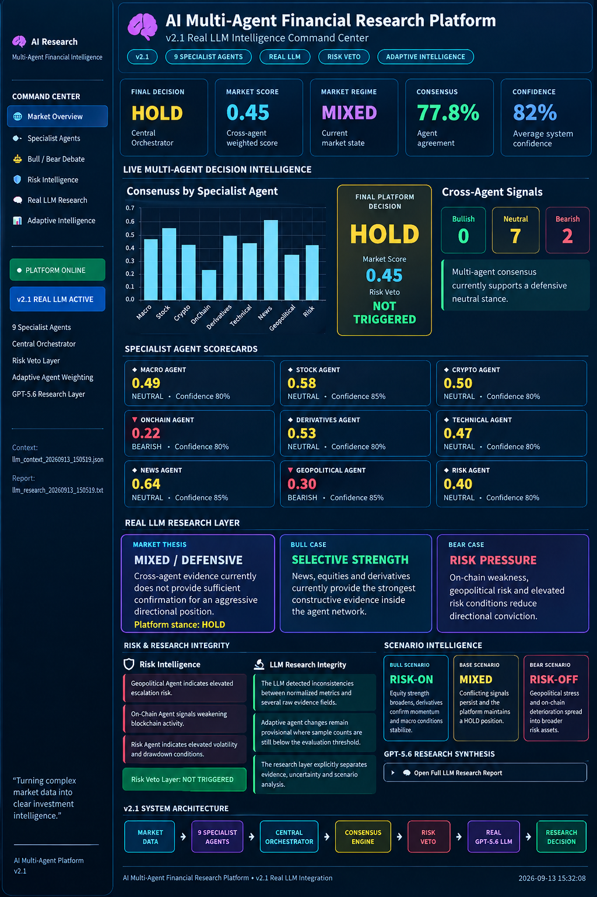

# AI Multi-Agent Financial Research Platform v2.1

An AI-powered multi-agent financial research and decision-intelligence platform combining **9 specialist agents**, quantitative market analysis, risk controls, adaptive weighting and a real **GPT-5.6 research layer**.

## Overview

The platform coordinates multiple specialist AI agents to analyze financial markets from different perspectives and combine their outputs into a structured research decision.

The system is designed around transparency and auditability: individual agent signals, confidence scores, risk observations and reasoning remain visible instead of being hidden behind a single model output.

## Multi-Agent Architecture

The platform includes 9 specialist agents:

1. Macro Agent
2. Stock Market Agent
3. Crypto Agent
4. On-Chain Agent
5. Derivatives Agent
6. Technical Analysis Agent
7. News & Sentiment Agent
8. Geopolitical Agent
9. Risk Management Agent

Each agent produces structured market signals, confidence scores, supporting evidence and risk observations.

A central orchestrator combines the specialist outputs and calculates the final market view.

## Consensus Engine

The orchestration layer evaluates:

- Agent signals
- Confidence levels
- Market scores
- Agreement and disagreement
- Consensus strength
- Cross-agent conflicts
- Risk conditions

This creates a coordinated market assessment rather than relying on a single AI model.

## Risk Veto Layer

Risk management is separated from normal market consensus.

The dedicated Risk Agent can override the normal multi-agent decision when critical risk conditions are detected.

This provides an additional defensive layer between research signals and the final decision.

## Adaptive Agent Weighting

The platform includes adaptive weighting infrastructure designed to adjust specialist influence as historical evaluation data grows.

Instead of permanently treating every agent as equally reliable, the architecture is designed to learn which specialists perform better under different market conditions.

## GPT-5.6 Research Layer

Version 2.1 introduces real LLM research synthesis using **GPT-5.6**.

The LLM does not simply summarize agent outputs. It evaluates agreement, disagreement, uncertainty, risk conditions and data-quality issues across the multi-agent system.

The generated institutional-style research report contains seven sections:

1. Market Thesis
2. Bull Case
3. Bear Case
4. Uncertainty Analysis
5. Scenario Analysis
6. Executive Summary
7. Actionable Research Conclusion

## Dashboard

The research dashboard visualizes key platform outputs including:

- Final decision
- Market score
- Market regime
- Consensus strength
- Average confidence
- Specialist agent scorecards
- Risk intelligence
- Research integrity
- Scenario intelligence

## Technology

- Python
- Multi-Agent Systems
- Large Language Models
- OpenAI GPT-5.6
- Quantitative Finance
- Financial Market Analysis
- On-Chain Analytics
- Risk Management
- Adaptive Intelligence

## Design Philosophy

The project focuses on:

**Transparency** — specialist reasoning remains visible.

**Auditability** — decisions can be traced back to agent signals and risk conditions.

**Risk Awareness** — risk controls remain independent from normal consensus.

**Measured Intelligence** — adaptive weighting is designed around evaluation data rather than assumed agent quality.

**Modularity** — individual components can be expanded without rebuilding the complete architecture.

## Development Roadmap

The platform is designed for continued development toward:

- Expanded market data
- Whale / Smart Money Intelligence
- Advanced adaptive intelligence
- Long-term market memory
- Scenario and stress testing
- Portfolio intelligence
- Self-evaluation and backtesting
- Advanced dashboards and alerts
- Quantum optimization research

## Project Status

**Version: v2.1**

Core multi-agent architecture, 9 specialist agents, central orchestration, consensus analysis, risk-veto logic, adaptive-weighting infrastructure, dashboard and GPT-5.6 research synthesis are implemented.

---

### AI + Multi-Agent Systems + Quantitative Finance

Building toward an integrated financial research and decision-intelligence architecture.
